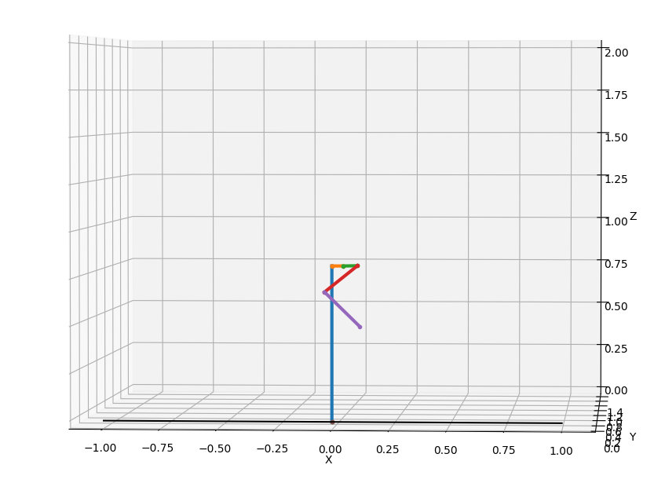

# python_simulation

This repository is a simulation of a monoped. Purpose of this simulation is to validate output of our controller. Initially, controller was examined on robot simulated in gazebo.(Here is the link to the repository: ). Since damping and friction had major impact on ground force reaction, new robot was simulated in python environment.
We used a slip model to generate the ground reaction force (hopper1d) and try to compute corresponding torques needed to be applied for each joints.


## Robot model

Here robot is descriped in URDF file. URDF, or Unified Robotics Description Format, is an XML specification used in academia and industry to model multibody systems such as robotic manipulator arms. For more information check http://wiki.ros.org/urdf 


## Dynamics
Next step for switching from gazebo to this simulation was to solve forward dynamic equation. This is done with help of RBDL(https://github.com/rbdl/rbdl). RBDL is a highly efficient C++ library that contains some essential rigid body dynamics algorithms such as the Articulated Body Algorithm (ABA) for forward dynamics, Recursive Newton-Euler Algorithm (RNEA) for inverse dynamics and the Composite Rigid Body Algorithm (CRBA) for the efficient computation of the joint space inertia matrix. 

## Plot and animation
Visualizing robot was another vital part of simulation.  To use 3D matplotlib,links were simplified as lines and joints as dots detween them. 

### Run an example:
After cloning this repository and installing dependecies. In terminal run:

```
python3 test_jump.py
``` 
Output should be somethig like picture below:




​
